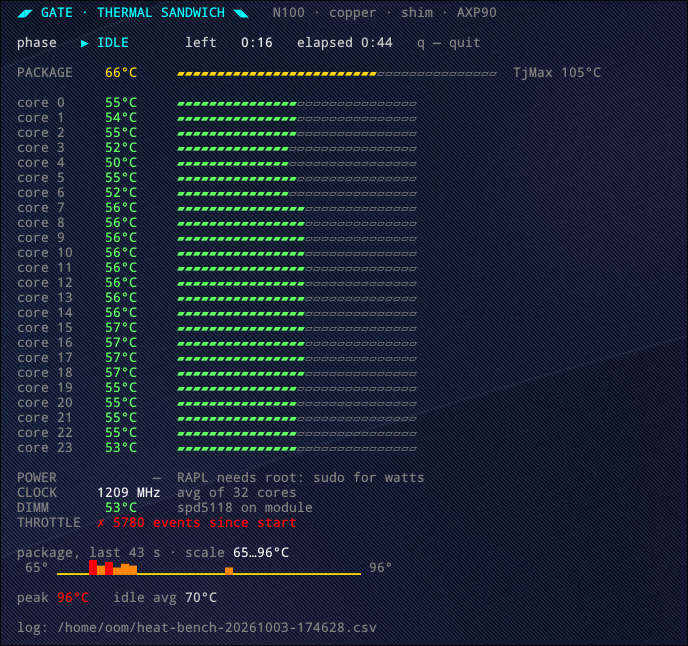

# ttop — thermal top

A live thermal monitor and bench for Intel CPUs, in pure bash.
No Python, no daemons, no dependencies beyond coreutils and awk — runs anywhere a shell does,
including a headless router over ssh.



*A 24-core laptop caught red-handed: a 96 °C spike and real throttling events, right in the "idle" phase.*

## Modes

| Command | What it does |
|---|---|
| `ttop watch` | live monitor: package and per-core temps, power, clock, DIMM, throttling, sparkline |
| `ttop` / `ttop bench [idle load cool]` | bench: IDLE → LOAD (`stress-ng` on all cores) → COOLDOWN, defaults 60/600/180 s |
| `ttop watch --log` | monitor with a CSV log |
| `ttop -h` | help |

Keys: `q` or Ctrl+C. The load is always stopped on exit.

## Honest sources only

- **coretemp** — the digital thermal sensor inside the die; the same one the CPU uses to decide when to throttle
- **RAPL** — package watts from the energy counter
- **thermal_throttle** — kernel counters of real throttling events
- **spd5118** — DDR5 module temperature, when present

RAPL energy is root-only since CVE-2020-8694 (PLATYPUS): without `sudo` everything works except watts,
which show `—`.

## Run

```sh
nix run github:miaupaw/ttop -- watch      # Nix
sudo ./ttop                               # or just the script
```

In bench mode `stress-ng` comes from `PATH`; if missing, ttop fetches it from nixpkgs.

## Origin

Born as a test rig for a homemade copper shim between an Intel N100 and its heatsink, on a NixOS router
called `gate` — part of the [Digital Phoenix](https://github.com/miaupaw) flake. The segmented bars
`▰▱` were picked from a dozen candidates because they look like 80s Japanese hardware.

## License

MIT
